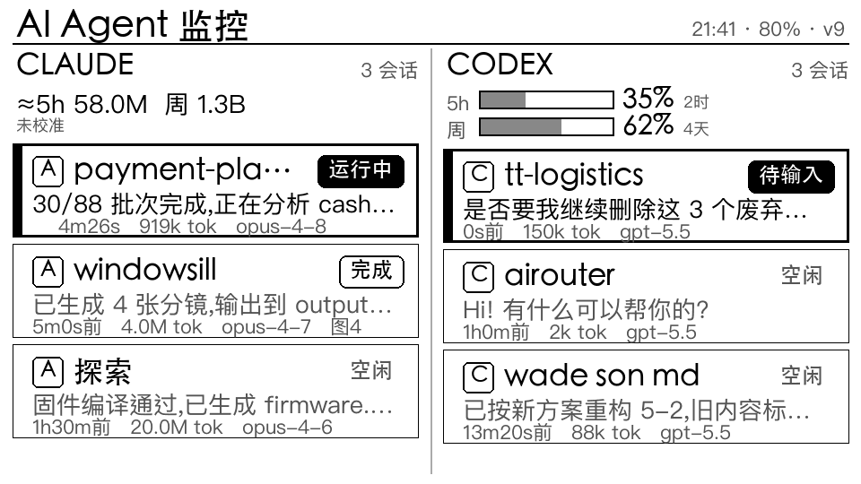

# agent-notifier

把长时间运行的 **AI 编程 agent(Codex / Claude Code)** 的进度、结果和订阅额度,推到一块
**M5PaperS3 电子墨水屏**上——抬头一瞥就知道任务跑到哪了、什么时候该回去,任务完成/等你输入
时**叮一声 + 弹屏提醒**。低功耗、常显、不刺眼。

> 起因:agent 干活周期长,人容易切去刷手机/做别的事;需要一个"随手一瞥 + 完成叫我"的物理面板,
> 而不是不停切屏盯进度。



## 架构(三层)

```
┌─────────────────────────────────────────────────────────────┐
│ collectors/     【1】agent 日志采集                            │
│   读 ~/.codex/sessions 与 ~/.claude/projects 的本地日志,       │
│   归一化成「会话状态 + 当前任务 + 耗时 + token + 额度」快照。    │
│   纯本地、纯读文件,不碰任何 OAuth/token(见「合规」)。         │
└───────────────┬─────────────────────────────────────────────┘
                │ build_snapshot()
┌───────────────▼─────────────────────────────────────────────┐
│ event_hub/      【2】事件中心:采集编排 + 事件服务 + 广播渠道   │
│   collector.py   主进程:定时快照 → 广播 + 完成/额度事件        │
│   eventserver.py hook POST → 事件(agent 一结束就实时上报)     │
│   thumbserver.py 灰度缩略图 + 固件 OTA(/fw)HTTP 服务          │
│   channels/                                                   │
│     mqtt.py   MQTT 渠道(retained 状态 + 事件 + 指令)——现役   │
│     ble.py    蓝牙渠道(飞牛 NAS 当 BLE 中心)——已验证 PoC     │
└───────────────┬─────────────────────────────────────────────┘
                │ WiFi+MQTT(现役) / BLE(规划中)
┌───────────────▼─────────────────────────────────────────────┐
│ firmware/       【3】设备 ROM(M5PaperS3 / ESP32-S3)          │
│   墨水屏渲染状态板 + 蜂鸣通知 + 深睡省电 + 无线 OTA。           │
└─────────────────────────────────────────────────────────────┘
```

## 目录

| 路径 | 作用 |
|---|---|
| `collectors/` | codex/claude 日志解析(`codex.py`/`claude.py`/`common.py`)+ 快照组装(`snapshot.py`) |
| `event_hub/` | 事件中心主进程 `collector.py`、事件接收 `eventserver.py`、缩略图+OTA `thumbserver.py` |
| `event_hub/channels/` | 广播渠道:`mqtt.py`(现役)、`ble.py`(蓝牙,PoC 已验证);后续可加 webhook 等 |
| `firmware/` | M5PaperS3 固件(PlatformIO + M5Unified,当前 v22) |
| `experiments/ble-poc/` | BLE 外设验证固件(留档) |
| `deploy/` | 部署件:launchd 模板、`mosquitto.conf`、`push_fw.sh`、agent hooks |
| `tools/sim_render.py` | 墨水屏布局模拟器(在电脑上渲染 PNG 迭代设计,不必反复烧录) |
| `config/config.example.toml` | 配置示例(复制为 `config/config.toml` 填真实值,已被 git 忽略) |

## 快速开始

### Gateway(采集 + 事件中心,跑在一台常开机器上)

```bash
pip install -r requirements.txt          # 仅 MQTT/缩略图需要 paho-mqtt / Pillow
cp config/config.example.toml config/config.toml   # 按需改 broker 地址/端口

# 本地调试:打印一次快照(不连 MQTT / 不查额度)
python3 -m event_hub.collector --once --print --no-quota

# 常驻:定时快照 + retained 发布 + 事件/额度告警
python3 -m event_hub.collector
```

持久化用 `deploy/com.user.m5monitor.plist.template`(macOS launchd):把 `__INSTALL_DIR__`
替换为仓库绝对路径,放进 `~/Library/LaunchAgents/` 后 `launchctl`。

MQTT broker 用 mosquitto:`deploy/mosquitto.conf` 是最小配置(局域网监听 + 允许匿名,仅家用)。

### 设备固件

```bash
cd firmware
cp include/secrets.h.example include/secrets.h   # 填 WiFi + broker IP
pio run -t upload -t monitor                      # 首次 USB 烧录
```
之后改固件只需 `deploy/push_fw.sh`(把 `config.h` 的 `FW_VERSION` +1 后跑),设备开机/定期
或收到 `m5paper/cmd=ota` 指令自动**无线更新**,不必再插线。

## 事件与主题(MQTT)

| Topic | QoS | 说明 |
|---|---|---|
| `m5paper/state` | 0 + retained | 完整状态板快照(额度 + 会话列表),几 KB JSON |
| `m5paper/events` | 1(离线排队) | 离散事件:`done` / `needs_input` / `quota` |
| `m5paper/cmd` | 1 | 指令,如 `ota`(远程触发设备自更新) |

事件 JSON 示例:
```json
{"kind":"done","src":"codex","project":"my-app",
 "msg":"已完成:导出 storyboard...","meta":"用时 2m · 1.0M tok · gpt-5.5","ts":1783344380}
```

## 额度与合规 ⚠️

本项目**只读你自己机器上的本地日志,不调用任何 OAuth/token 接口**,零封禁风险:

- **Codex**:5h/周额度是 codex 自己写在本地 rollout(`~/.codex/sessions/**`)的 `rate_limits`,
  直接读即可(真实值)。注意:Codex Desktop 的 computer-use 类会话会记 `0`,故取「全局最新的
  非零读数」,重度用这类会话时额度可能滞后。
- **Claude**:官方日志不含 rate_limit 字段,故用本地 JSONL 的 token 按 5h/7天滚动窗口累加
  **估算**(ccusage 式纯本地做法),可选一次性校准出百分比。

> 那些"很准"的第三方工具用的是订阅 OAuth token 调 Anthropic/OpenAI 的用量接口——准确但触碰
> 服务条款、有账号风险。本项目**刻意不走这条路**,用可读性换零风险。

## 通知触发

| | 完成 | 待输入 | 机制 |
|---|---|---|---|
| Claude | ✅ | ✅ | hook(`Stop`/`Notification` → `deploy/hooks/on_event.sh` → eventserver) |
| Codex | ✅ | —— | 日志检测(rollout `task_complete` 的 `completed_at`,≤刷新周期) |
| 额度告警 | ✅ 两家 | | 采集器算,`≥85%` 自动发一次 |

装 hook:`python3 deploy/hooks/install_hooks.py`(幂等追加,自动备份;`--uninstall` 卸载)。

## BLE 现状(规划中的省电通道)

设备当"电池 + 纯通知端"时,WiFi 有个根本矛盾:即时推送要保持长连接(费电)、省电要深睡
(通知延迟)。**BLE 能兼得低功耗 + 即时**,方向已验证:

- ✅ **飞牛 NAS(Debian/BlueZ,MediaTek MT7961)当 BLE 中心可行**——headless 常驻无权限坑;
- ⛔ **macOS 当 BLE 中心不适合常驻**——TCC 权限对后台守护进程基本不放行;
- ✅ 端到端 PoC 打通:飞牛 → BLE 写通知 → 设备蜂鸣(RSSI -66 够用);
- 📋 完整版待做:设备 BLE 外设 + 低功耗连接态 + 加回显示 + WiFi 按需 OTA;飞牛跑 MQTT broker +
  BLE 桥常驻。见 `event_hub/channels/ble.py` 的 TODO。

## 硬件

M5PaperS3:ESP32-S3R8 + 4.7" 960×540 16 级灰度墨水屏(ED047TC1 直驱)+ GT911 触摸 + 无源蜂鸣器
+ 1800mAh 电池。⚠️ **不要用 QC/PD 快充口供电**(时序问题可能过压烧板),用普通 5V。

## License

MIT
